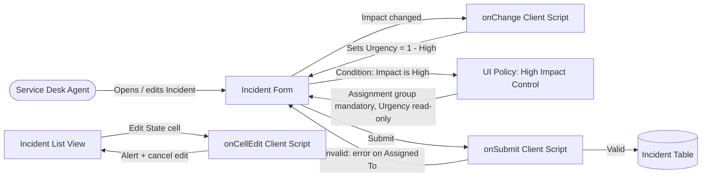

# Requirement Analysis
## Data Flow Diagram & User Stories

| Date | 30 September 2026 |
| --- | --- |
| Team ID | SWTID-2026-5353 |
| Project Name | Implement Client Script & UI Policy (Incident) |
| Maximum Marks | 4 Marks |

## Data Flow Diagram

## User Stories

| User Type | Functional Requirement (Epic) | User Story Number | User Story / Task | Acceptance Criteria | Priority | Release |
| --- | --- | --- | --- | --- | --- | --- |
| Service Desk Agent | UI Policy | USN-1 | As an agent, I must provide an Assignment group when Impact is High | Assignment group shows as mandatory; becomes optional again when Impact is not High | High | Sprint-1 |
| Service Desk Agent | UI Policy | USN-2 | As an agent, I cannot change Urgency manually on High-impact incidents | Urgency is read-only when Impact = High; editable again otherwise | Medium | Sprint-1 |
| Service Desk Agent | Client Script (onChange) | USN-3 | As an agent, I want Urgency set automatically when I choose High impact | Urgency becomes 1 - High and an info message appears | High | Sprint-1 |
| Service Desk Agent | Client Script (onSubmit) | USN-4 | As an agent, I am prevented from saving a High-impact incident without Assigned To | Save is blocked; error shown on Assigned To | High | Sprint-2 |
| Service Desk Agent | Client Script (onCellEdit) | USN-5 | As a team lead, I want State changes blocked in list view | Alert is shown; State value stays unchanged; form edit still works | Medium | Sprint-2 |
| Administrator | Testing | USN-6 | As an admin, I want to verify all rules end-to-end | All test cases in the UAT report pass | High | Sprint-2 |
