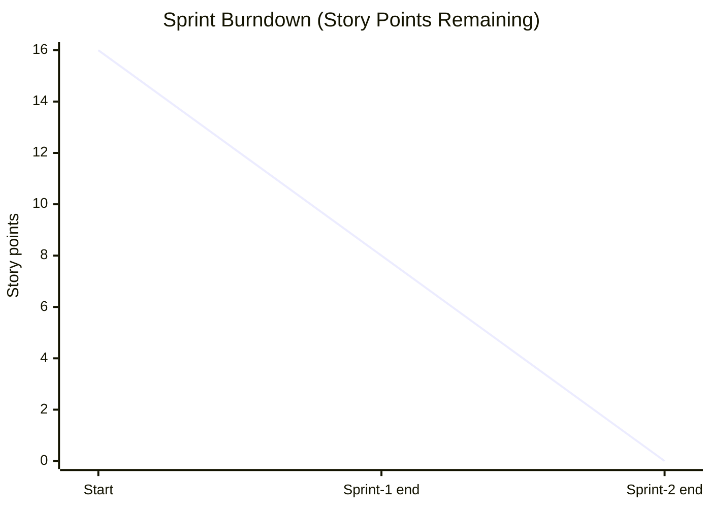

# Project Planning Phase
## Project Planning Template (Product Backlog, Sprint Planning, Stories, Story Points)

| Date | 30 September 2026 |
| --- | --- |
| Team ID | SWTID-2026-5353 |
| Project Name | Implement Client Script & UI Policy (Incident) |
| Maximum Marks | 5 Marks |

## Product Backlog, Sprint Schedule and Estimation (4 Marks)

| Sprint | Functional Requirement (Epic) | User Story Number | User Story / Task | Story Points | Priority | Team Members |
| --- | --- | --- | --- | --- | --- | --- |
| Sprint-1 | UI Policy (Epic 1) | USN-1 | Create *High Impact Control* policy; Assignment group mandatory; Reverse if false | 3 | High | |
| Sprint-1 | UI Policy (Epic 1) | USN-2 | Add UI Policy Action: Urgency read-only | 2 | Medium | |
| Sprint-1 | Client Scripts (Epic 2) | USN-3 | Create onChange script to auto-set Urgency | 3 | High | |
| Sprint-2 | Client Scripts (Epic 2) | USN-4 | Create onSubmit script to block save without Assigned To | 3 | High | |
| Sprint-2 | Client Scripts (Epic 2) | USN-5 | Create onCellEdit script to block State list edit | 2 | Medium | |
| Sprint-2 | Testing (Epic 3) | USN-6 | Execute UAT cases (mandatory, save, reverse, list edit, form update) | 3 | High | |

## Project Tracker, Velocity & Burndown Chart (4 Marks)

| Sprint | Total Story Points | Duration | Sprint Start Date | Sprint End Date (Planned) | Story Points Completed (as on Planned End Date) | Sprint Release Date (Actual) |
| --- | --- | --- | --- | --- | --- | --- |
| Sprint-1 | 8 | 2 Days | 28 Sep 2026 | 29 Sep 2026 | 8 | 29 Sep 2026 |
| Sprint-2 | 8 | 1 Day | 30 Sep 2026 | 30 Sep 2026 | 8 | 30 Sep 2026 |

> Adjust the dates and assign team members to match your actual schedule.

### Velocity
Total story points = 8 + 8 = **16**; number of sprints = 2.

**Velocity = 16 / 2 = 8 story points per sprint.**

### Burndown Chart

**Reference:** https://www.atlassian.com/agile/tutorials/burndown-charts
