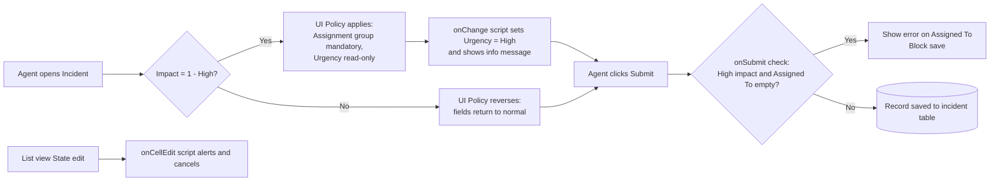

# Project Design Phase
## Solution Architecture

| Date | 30 September 2026 |
| --- | --- |
| Team ID | SWTID-2026-5353 |
| Project Name | Implement Client Script & UI Policy (Incident) |
| Maximum Marks | 4 Marks |

## Solution Architecture
Solution architecture bridges the gap between the business problem (poor Incident data quality) and the technology solution (client-side controls on ServiceNow).

### Goals
- Enforce business rules at the user-interface level.
- Keep behaviour transparent to users through clear messages.
- Use only platform-native features (UI Policy and Client Scripts).

### Design Decisions
| Area | Decision |
| --- | --- |
| Conditional mandatory / read-only | UI Policy, because it is declarative and reversible |
| Auto-populated Urgency | onChange Client Script on `impact`, skipping form load |
| Save-time validation | onSubmit Client Script returning `false` to stop submission |
| List editing control | onCellEdit Client Script calling `callback(false)` |
