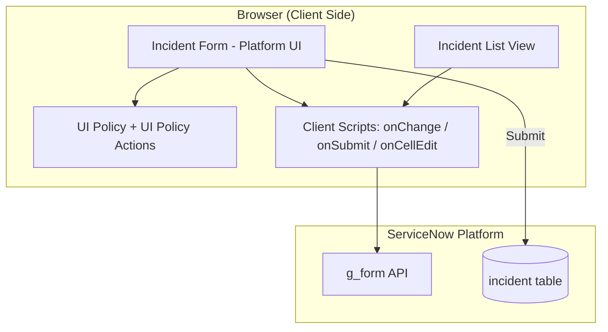

# Requirement Analysis
## Technology Stack (Architecture & Stack)

| Date | 30 September 2026 |
| --- | --- |
| Team ID | SWTID-2026-5353 |
| Project Name | Implement Client Script & UI Policy (Incident) |
| Maximum Marks | 4 Marks |

## Technical Architecture

### Table-1: Components & Technologies
| S.No | Component | Description | Technology |
| --- | --- | --- | --- |
| 1 | User Interface | Incident form and list view used by agents | ServiceNow Platform UI (Next Experience) |
| 2 | Application Logic-1 | Conditional field behaviour (mandatory / read-only) | UI Policy & UI Policy Actions |
| 3 | Application Logic-2 | Auto-set Urgency and save-time validation | Client Scripts (JavaScript, `g_form` API) |
| 4 | Application Logic-3 | List edit blocking | onCellEdit Client Script |
| 5 | Database | Incident records | ServiceNow `incident` table |
| 6 | Cloud Database | Managed by the platform | ServiceNow cloud instance |
| 7 | File Storage | Not required | N/A |
| 8 | External API | Not used | N/A |
| 9 | Machine Learning Model | Not used | N/A |
| 10 | Infrastructure | Cloud-hosted instance | ServiceNow Personal Developer Instance |

### Table-2: Application Characteristics
| S.No | Characteristics | Description | Technology |
| --- | --- | --- | --- |
| 1 | Open-Source Frameworks | None; uses native platform capabilities | ServiceNow low-code |
| 2 | Security Implementations | Platform authentication and role-based access; scripts run with *Isolate script* enabled | ServiceNow ACLs / roles |
| 3 | Scalable Architecture | Rules defined per table and field; reusable for other tables | Platform metadata |
| 4 | Availability | Inherits platform availability | ServiceNow cloud |
| 5 | Performance | Client-side only; no extra server round trips | g_form / UI Policy |

**References:** https://docs.servicenow.com
